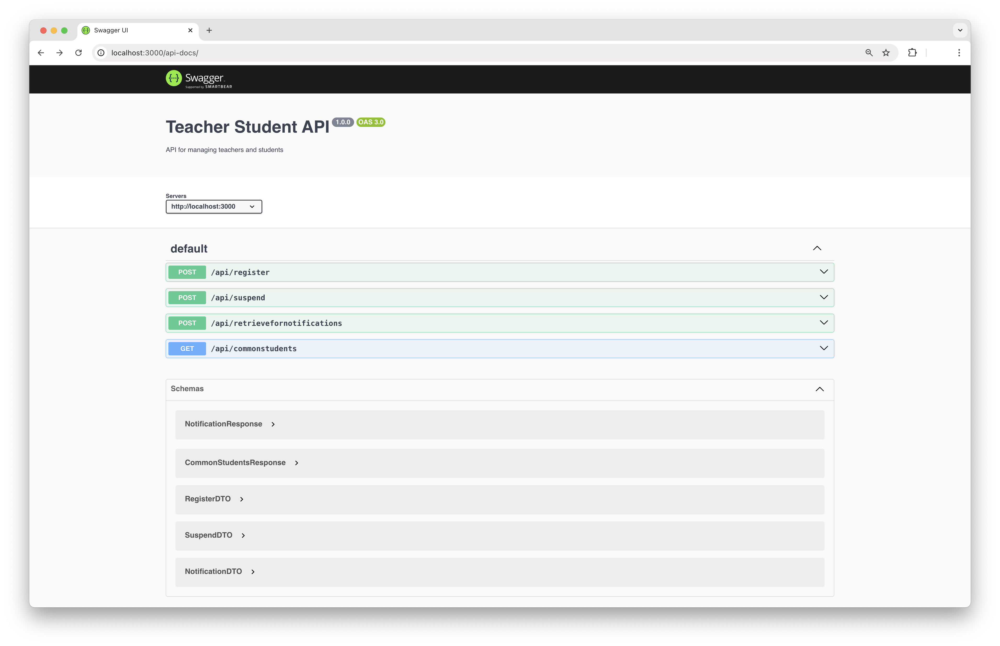
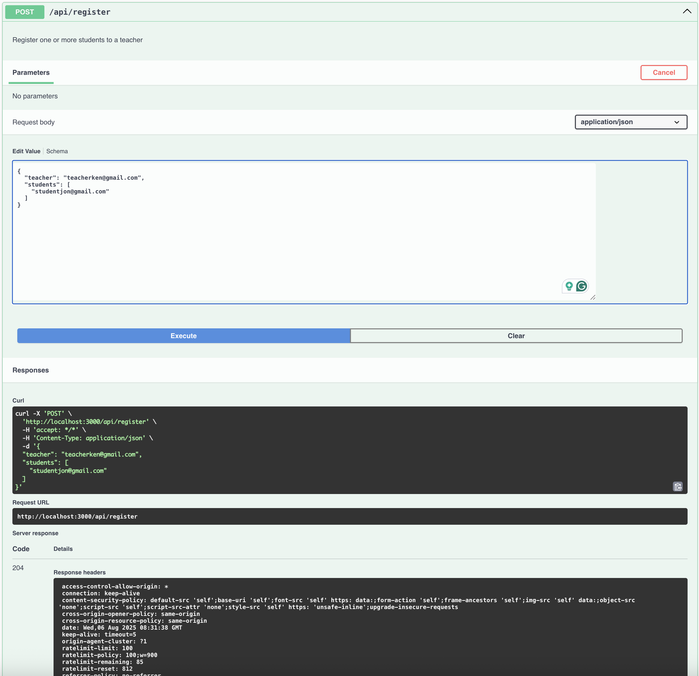
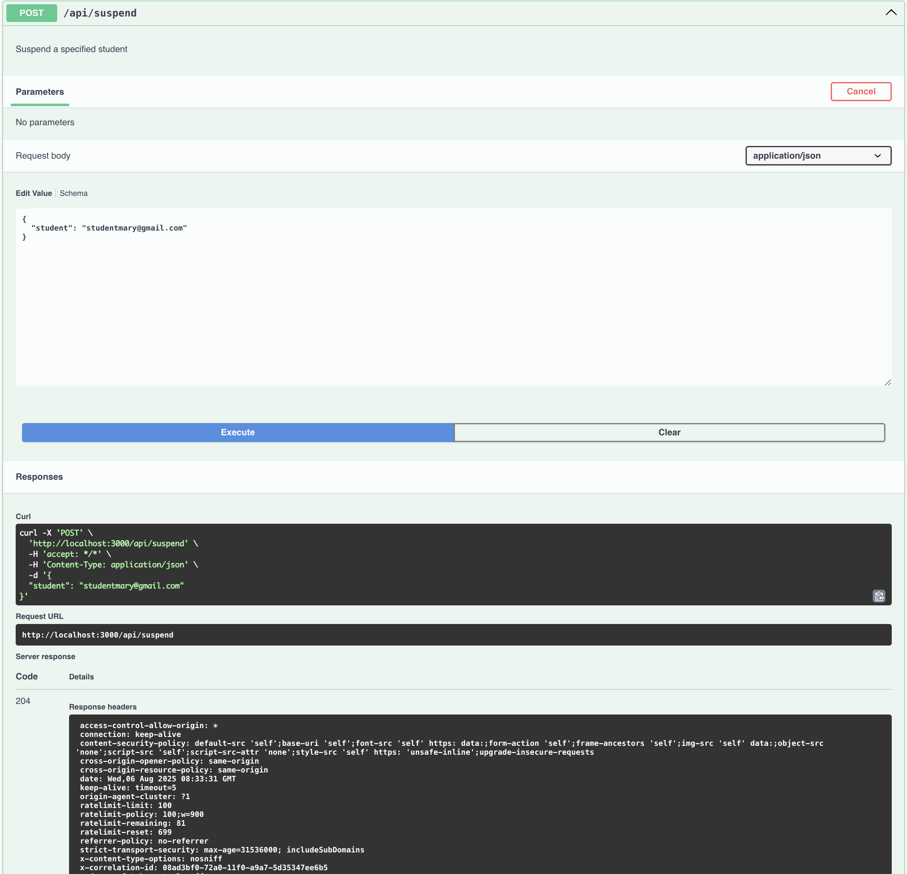
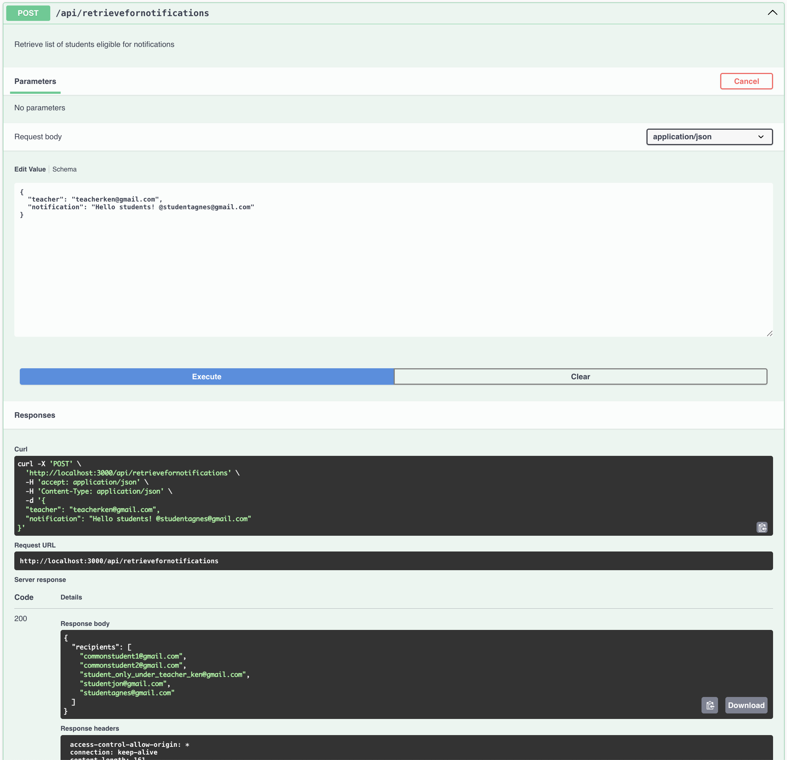
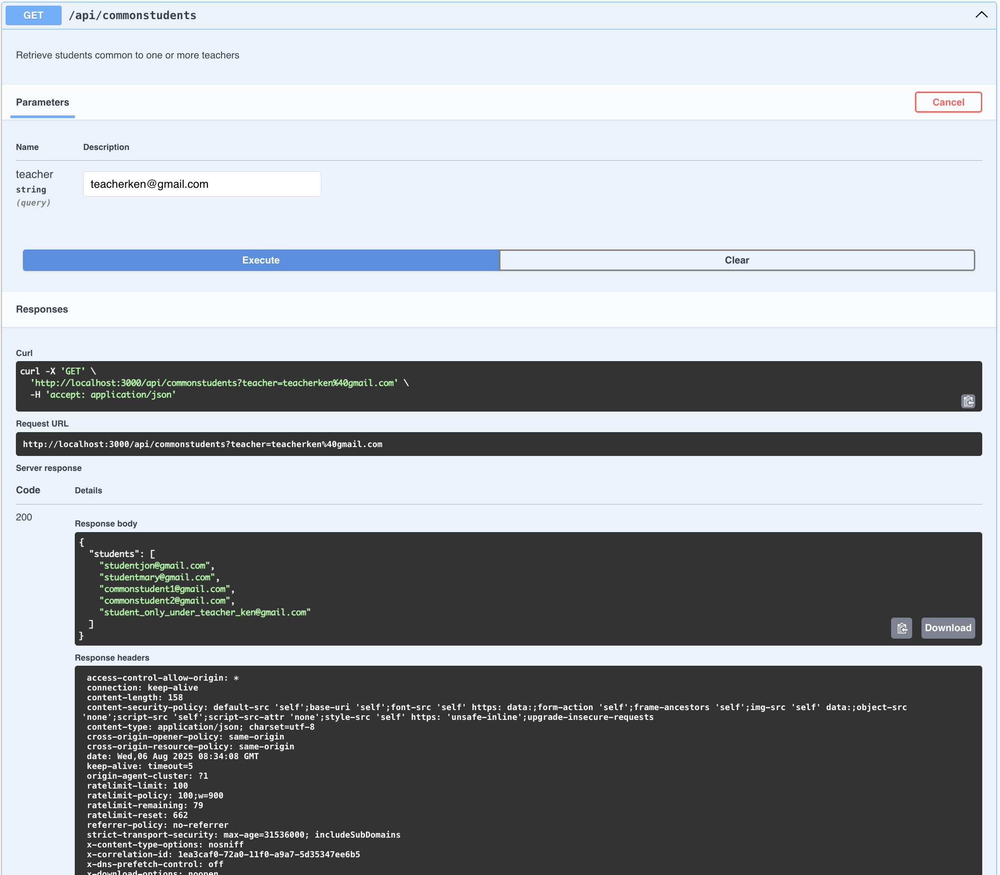
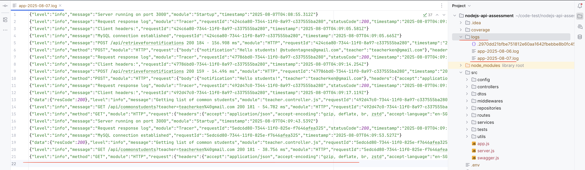
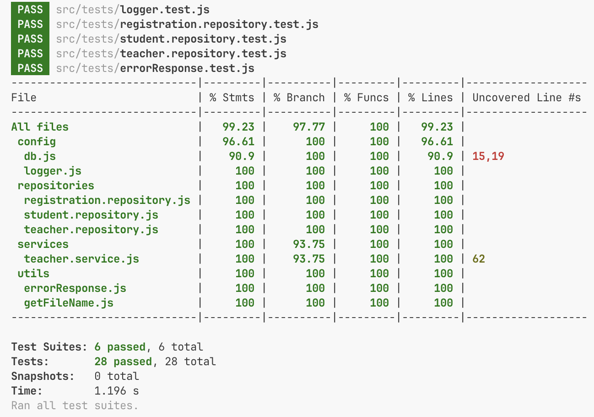

# 🧑‍🏫 Teacher Student API

## 🧩 Overview

A RESTful API to manage teacher-student relationships — including registration, suspension, and notifications.  
Built with **Node.js**, **Express**, and **MySQL**, this project adheres to best practices: modular architecture, input validation, logging, and unit testing.

---

## 📚 Table of Contents

- [🧑‍🏫 Teacher Student API](#-teacher-student-api)
  - [🧩 Overview](#-overview)
  - [📚 Table of Contents](#-table-of-contents)
  - [📸 API Documentation Screenshots](#-api-documentation-screenshots)
  - [📊 Logs and Test Coverage](#-logs-and-test-coverage)
    - [🧾 Winston Logs Output](#-winston-logs-output)
    - [✅ Test Coverage Report](#-test-coverage-report)
  - [📖 Background](#-background)
  - [🌟 Features](#-features)
  - [🧑‍💼 User Stories](#-user-stories)
  - [🛠️ Technology Stack](#️-technology-stack)
  - [🚀 Getting Started](#-getting-started)
    - [📦 Prerequisites](#-prerequisites)
  - [🖥️ Running Locally](#️-running-locally)
  - [🔗 API Endpoints](#-api-endpoints)
  - [🧪 Testing](#-testing)
  - [📦 Deployment](#-deployment)
  - [🧱 Project Structure](#-project-structure)
  - [❗ Error Handling](#-error-handling)
  - [🤝 Contributing](#-contributing)
  - [📬 Contact](#-contact)
  - [🙏 Thank You](#-thank-you)

---

## 📸 API Documentation Screenshots

<details>
  <summary>Click to expand API screenshots</summary>

  
  
  
  


</details>

---

## 📊 Logs and Test Coverage

### 🧾 Winston Logs Output



### ✅ Test Coverage Report



---

## 📖 Background

Teachers need a system to perform administrative functions for their students. Teachers and students are identified by email addresses. This API supports core functionalities outlined in the user stories below.

---

## 🌟 Features

- Input validation using **Zod**
- Auto-generated **Swagger** documentation
- **Rate limiting** & security headers
- Structured **Winston** logging with correlation IDs
- Clean, layered, and modular architecture

---

## 🧑‍💼 User Stories

1. **Register Students to Teacher**
   - Teachers can register one or more students.
   - Students can be registered to multiple teachers.

2. **Retrieve Common Students**
   - Fetch students common to one or more teachers.

3. **Suspend Student**
   - Suspend a student from receiving notifications.

4. **Retrieve Students for Notifications**
   - Get eligible students based on registration and `@mentions`, excluding suspended ones.

---

## 🛠️ Technology Stack

- **Backend:** Node.js + Express
- **Database:** MySQL (via `mysql2` Promise API)
- **Validation:** Zod + zod-to-openapi (Swagger)
- **Logging:** Winston + correlation IDs
- **Testing:** Jest
- **Other:** Rate limiting, error middleware, modular layers

---

## 🚀 Getting Started

### 📦 Prerequisites

- Node.js (v18+)
- MySQL Server (local/remote)
- npm or yarn

---

## 🖥️ Running Locally

1. **Clone the repository**

```bash
git clone https://github.com/syukronarie/teacher-student-api.git
cd teacher-student-api
```

2. **Install dependencies**

```bash
npm install
```

3. **Set up environment variables**

Create a `.env` file in the root directory with:

```env
DB_HOST=localhost
DB_USER=root
DB_PASSWORD=yourpassword
DB_NAME=teacher_student_db
PORT=3000
RATE_LIMIT_WINDOW=15
RATE_LIMIT_MAX=100
```

4. **Initialize the database**

Run the SQL schema or use a migration tool to create required tables.

5. **Start the server**

```bash
npm start
```

API docs: [http://localhost:3000/api-docs](http://localhost:3000/api-docs)

---

## 🔗 API Endpoints

| Endpoint                        | Method | Description                             | Input                                       | Response         |
| ------------------------------- | ------ | --------------------------------------- | ------------------------------------------- | ---------------- |
| `/api/register`                 | POST   | Register students to a teacher          | `{ teacher: string, students: string[] }`   | `204 No Content` |
| `/api/commonstudents`           | GET    | Retrieve common students among teachers | Query: `teacher=email1&teacher=email2...`   | `200 OK`         |
| `/api/suspend`                  | POST   | Suspend a specific student              | `{ student: string }`                       | `204 No Content` |
| `/api/retrievefornotifications` | POST   | Get students eligible for notifications | `{ teacher: string, notification: string }` | `200 OK`         |

---

## 🧪 Testing

Use **Jest** to run unit tests.

```bash
npm test
```

To generate test coverage:

```bash
npm run test:coverage
```

---

## 📦 Deployment

API Base URL can be configured via environment variables or deployment platform settings.

---

## 🧱 Project Structure

```bash
/src
  /config             # DB and logger configs
  /dtos               # Zod validation schemas
  /middlewares        # Error, rate limiters, IDs
  /repositories       # DB access logic
  /services           # Business logic
  /controllers        # Request handlers
  /routes             # Route definitions
  swagger.js          # Swagger/OpenAPI config
  app.js              # Express app setup
  server.js           # Server entry point
/tests                # Jest unit tests
.env                  # Environment config
README.md             # This file
```

---

## ❗ Error Handling

All errors are returned in the following format:

```json
{ "message": "Meaningful error message" }
```

With appropriate HTTP status codes:

- `400` – Validation errors
- `404` – Resource not found
- `500` – Internal server error

---

## 🤝 Contributing

Feel free to fork, raise issues, or submit pull requests to improve this project.

---

## 📬 Contact

**Email:** [syukronarie@gmail.com](mailto:syukronarie@gmail.com)  
📭 Open for feedback and collaboration!

---

## 🙏 Thank You

Thank you for reviewing this assessment! Looking forward to your feedback.
